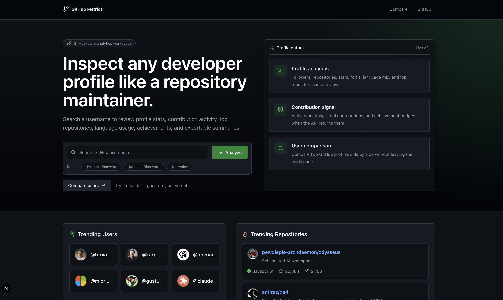
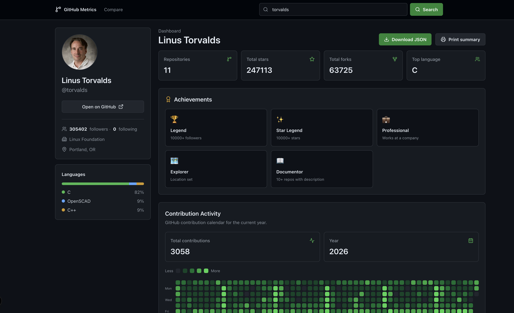
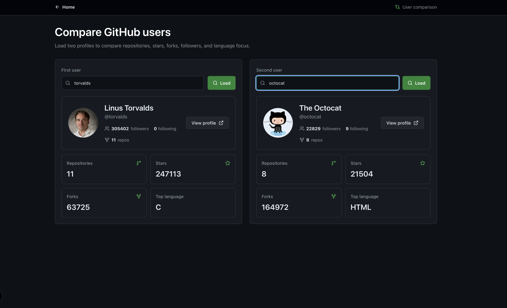
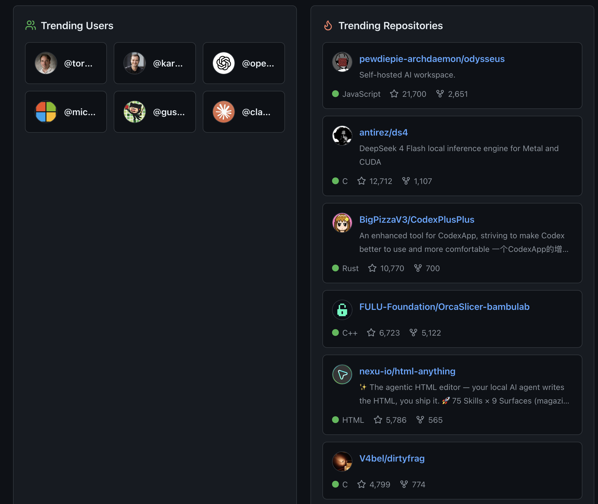

# 🚀 GitHub Metrics

<div align="center">

**Professional GitHub Analytics Dashboard for Developers**

[](https://nextjs.org/)
[](https://react.dev/)
[](https://www.typescriptlang.org/)
[](https://fastapi.tiangolo.com/)
[](https://www.python.org/)
[](LICENSE)

[Live Demo](#-live-demo) • [Features](#-features) • [Installation](#-installation) • [Documentation](#-documentation) • [Contributing](#-contributing)

</div>

---

## 📋 Overview

**GitHub Metrics** is a powerful, full-stack analytics platform that empowers developers to gain deep insights into their GitHub profiles, repositories, and contribution patterns. Through an intuitive, interactive dashboard, users can visualize their coding journey, compare their performance with other developers, and discover actionable insights about their programming habits.

Whether you're preparing for technical interviews, tracking your open-source contributions, or simply curious about your coding patterns, GitHub Metrics provides a comprehensive analytical lens into your GitHub activity.

> **Built for developers, by developers.** Designed to transform raw GitHub data into meaningful insights.

---

## ✨ Key Highlights

- 📊 **Comprehensive Analytics** - Analyze profiles, repositories, contributions, and programming languages
- 🎯 **Developer Comparison** - Compare your stats with other developers side-by-side
- 📈 **Real-Time Data** - Fetch and display live GitHub data through seamless API integration
- 🎨 **Beautiful Visualizations** - Interactive charts, heatmaps, and contribution graphs
- ⚡ **Lightning Fast** - Built with modern tech stack for optimal performance
- 📱 **Fully Responsive** - Works perfectly on desktop, tablet, and mobile devices
- 🔍 **Advanced Search** - Find and analyze any GitHub profile instantly

---

## 🎯 Live Demo -- comming soon 

<div align="center">
### [👉 Visit Live Demo](https://github-metrics-demo.com)

*Coming Soon - GitHub Metrics Beta*

</div>

---

## 📸 Screenshots

<div align="center">

### Dashboard



### Profile Analytics



### Developer Comparison



### Trending Repositories & Users



</div>

---

## 🌟 Features

| Feature | Description | Status |
|---------|-------------|--------|
| **Profile Analytics** | Detailed GitHub profile statistics and metrics | ✅ |
| **Repository Insights** | In-depth analysis of repositories with language breakdown | ✅ |
| **Contribution Statistics** | Track contributions, commits, and pull requests | ✅ |
| **Developer Comparison** | Compare multiple developers side-by-side | ✅ |
| **Language Analysis** | Programming language distribution and trends | ✅ |
| **Contribution Heatmap** | Visual representation of contribution patterns | ✅ |
| **Repository Intelligence** | Advanced metrics for repository performance | ✅ |
| **Real-Time Data** | Live GitHub API integration for current data | ✅ |
| **User Search** | Quick search functionality for any GitHub user | ✅ |
| **Export Functionality** | Export analytics as PDF or CSV | 🔄 |
| **Achievement Badges** | Display GitHub milestones and achievements | ✅ |
| **Dark Mode Support** | Eye-friendly dark theme | 🔄 |

---

## 🛠️ Tech Stack

### Frontend

| Technology | Version | Purpose |
|------------|---------|---------|
| **Next.js** | ^14.0 | React framework with SSR and optimization |
| **React** | ^18.0 | UI component library |
| **TypeScript** | ^5.0 | Type-safe JavaScript development |
| **Tailwind CSS** | ^3.0 | Utility-first CSS framework |
| **Axios** | ^1.0 | HTTP client for API calls |
| **Recharts** | ^2.0 | Data visualization library |

### Backend

| Technology | Version | Purpose |
|------------|---------|---------|
| **FastAPI** | ^0.100 | High-performance Python web framework |
| **Python** | ^3.10 | Core backend language |
| **Pydantic** | ^2.0 | Data validation and settings |
| **PyGithub** | ^2.0 | GitHub API wrapper |
| **SQLAlchemy** | ^2.0 | ORM for database operations |
| **Redis** | ^4.0 | Caching and performance optimization |

---

## 🏗️ Architecture

```
┌─────────────────────────────────────────────────────────────┐
│                     Frontend (Next.js)                        │
│  ┌──────────────┐  ┌──────────────┐  ┌──────────────┐       │
│  │  Dashboard   │  │   Profile    │  │   Compare    │       │
│  │    Pages     │  │  Analytics   │  │   Dashboard  │       │
│  └──────────────┘  └──────────────┘  └──────────────┘       │
│         ↓                ↓                    ↓               │
│  ┌──────────────────────────────────────────────────┐       │
│  │      React Components + Tailwind CSS             │       │
│  └──────────────────────────────────────────────────┘       │
└─────────────────────────────────────────────────────────────┘
                             ↓
                  ┌──────────────────┐
                  │   REST API       │
                  │  (HTTP/HTTPS)    │
                  └──────────────────┘
                             ↓
┌─────────────────────────────────────────────────────────────┐
│                  Backend (FastAPI)                            │
│  ┌──────────────┐  ┌──────────────┐  ┌──────────────┐       │
│  │   Routes     │  │   Services   │  │   Schemas    │       │
│  └──────────────┘  └──────────────┘  └──────────────┘       │
│         ↓                ↓                    ↓               │
│  ┌──────────────────────────────────────────────────┐       │
│  │      GitHub API Integration Layer               │       │
│  └──────────────────────────────────────────────────┘       │
│         ↓                ↓                    ↓               │
│  ┌──────────────┐  ┌──────────────┐  ┌──────────────┐       │
│  │   Database   │  │    Cache     │  │    Logger    │       │
│  └──────────────┘  └──────────────┘  └──────────────┘       │
└─────────────────────────────────────────────────────────────┘
```

---

## 📁 Folder Structure

```
github-metrics/
├── frontend/
│   ├── app/
│   │   ├── dashboard/
│   │   ├── profile/
│   │   ├── compare/
│   │   ├── layout.tsx
│   │   └── page.tsx
│   ├── components/
│   │   ├── Dashboard/
│   │   ├── ProfileAnalytics/
│   │   ├── ComparisonDashboard/
│   │   ├── Charts/
│   │   ├── Cards/
│   │   ├── Search/
│   │   └── shared/
│   ├── lib/
│   │   ├── api.ts
│   │   ├── utils.ts
│   │   └── constants.ts
│   ├── styles/
│   ├── public/
│   ├── package.json
│   └── tsconfig.json
│
├── backend/
│   ├── app/
│   │   ├── main.py
│   │   ├── api/
│   │   │   ├── routes/
│   │   │   │   ├── users.py
│   │   │   │   ├── repositories.py
│   │   │   │   └── analytics.py
│   │   │   └── dependencies.py
│   │   ├── services/
│   │   │   ├── github_service.py
│   │   │   ├── analytics_service.py
│   │   │   └── cache_service.py
│   │   ├── models/
│   │   ├── schemas/
│   │   ├── database/
│   │   └── config.py
│   ├── tests/
│   ├── requirements.txt
│   └── .env.example
│
├── docs/
│   ├── API.md
│   ├── ARCHITECTURE.md
│   └── SETUP.md
│
├── docker-compose.yml
├── README.md
└── LICENSE
```

---

## 🚀 Installation

### Prerequisites

- **Node.js** 18.x or higher (for frontend)
- **Python** 3.10 or higher (for backend)
- **Git** for version control
- **GitHub Personal Access Token** for API access

### Frontend Setup

```bash
# Navigate to frontend directory
cd frontend

# Install dependencies
npm install

# Create environment variables file
cp .env.example .env.local

# Update .env.local with your API endpoint
# NEXT_PUBLIC_API_URL=http://localhost:8000

# Start development server
npm run dev
```

The frontend will be available at `http://localhost:3000`

**Available Scripts:**
```bash
npm run dev      # Start development server
npm run build    # Create optimized production build
npm start        # Run production build
npm run lint     # Run ESLint
npm run type-check  # Check TypeScript types
```

### Backend Setup

```bash
# Navigate to backend directory
cd backend

# Create virtual environment
python -m venv venv

# Activate virtual environment
# On Windows:
venv\Scripts\activate
# On macOS/Linux:
source venv/bin/activate

# Install dependencies
pip install -r requirements.txt

# Create environment variables file
cp .env.example .env

# Update .env with your GitHub token and configuration
# GITHUB_TOKEN=your_github_token_here
# DATABASE_URL=sqlite:///./data.db

# Run database migrations
alembic upgrade head

# Start development server
uvicorn app.main:app --reload
```

The backend API will be available at `http://localhost:8000`

**API Documentation:**
- Swagger UI: `http://localhost:8000/docs`
- ReDoc: `http://localhost:8000/redoc`

---

## 🔌 API Endpoints

### User Endpoints

```
GET    /api/users/{username}           - Get user profile analytics
GET    /api/users/{username}/repos     - Get user repositories
GET    /api/users/{username}/stats     - Get detailed statistics
GET    /api/users                      - Search users
```

### Repository Endpoints

```
GET    /api/repos/{owner}/{repo}       - Get repository details
GET    /api/repos/{owner}/{repo}/stats - Get repository statistics
GET    /api/repos/{owner}/{repo}/langs - Get language breakdown
```

### Analytics Endpoints

```
GET    /api/analytics/compare          - Compare multiple users
GET    /api/analytics/{username}/heatmap - Get contribution heatmap
GET    /api/analytics/{username}/languages - Get language analysis
```

### Health Check

```
GET    /health                         - API health status
```

> For detailed API documentation, start the backend server and visit `/docs`

---

## 🐳 Docker Deployment

### Using Docker Compose

```bash
# Build and start containers
docker-compose up -d

# View logs
docker-compose logs -f

# Stop containers
docker-compose down
```

**docker-compose.yml:**
```yaml
version: '3.8'

services:
  backend:
    build: ./backend
    ports:
      - "8000:8000"
    environment:
      - DATABASE_URL=postgresql://user:password@db:5432/github_metrics
      - GITHUB_TOKEN=${GITHUB_TOKEN}
      - REDIS_URL=redis://redis:6379
    depends_on:
      - db
      - redis

  frontend:
    build: ./frontend
    ports:
      - "3000:3000"
    environment:
      - NEXT_PUBLIC_API_URL=http://backend:8000

  db:
    image: postgres:15
    environment:
      - POSTGRES_USER=user
      - POSTGRES_PASSWORD=password
      - POSTGRES_DB=github_metrics
    volumes:
      - postgres_data:/var/lib/postgresql/data

  redis:
    image: redis:7-alpine
    ports:
      - "6379:6379"

volumes:
  postgres_data:
```

---

## 🚀 Deployment

### Deploy to Vercel (Frontend)

```bash
# Install Vercel CLI
npm i -g vercel

# Deploy from frontend directory
cd frontend
vercel --prod
```

### Deploy to Heroku (Backend)

```bash
# Install Heroku CLI
npm install -g heroku

# Login to Heroku
heroku login

# Create app
heroku create github-metrics-api

# Set environment variables
heroku config:set GITHUB_TOKEN=your_token

# Deploy
git push heroku main
```

### Deploy to AWS/GCP/Azure

Refer to `docs/DEPLOYMENT.md` for cloud platform-specific instructions.

---

## 📈 Roadmap

- [x] Basic profile analytics
- [x] Repository insights
- [x] Contribution statistics
- [x] Developer comparison dashboard
- [x] Contribution heatmap
- [ ] Export to PDF/CSV
- [ ] Dark mode theme
- [ ] Advanced filtering options
- [ ] Social sharing features
- [ ] Leaderboards
- [ ] Custom dashboards
- [ ] Email notifications
- [ ] Mobile app (React Native)
- [ ] Organization analytics
- [ ] Integration with other platforms (GitLab, Bitbucket)

---

## 📚 Documentation

- **[API Documentation](docs/API.md)** - Complete API reference
- **[Architecture Guide](docs/ARCHITECTURE.md)** - System design and components
- **[Setup Instructions](docs/SETUP.md)** - Detailed setup guide
- **[Contributing Guide](CONTRIBUTING.md)** - How to contribute

---

## 🤝 Contributing

We love contributions from the community! Whether it's bug reports, feature requests, or code contributions, your help is greatly appreciated.

### Getting Started

1. **Fork the repository**
   ```bash
   git clone https://github.com/Akash-Dhanwate/github-metrics.git
   cd github-metrics
   ```

2. **Create a feature branch**
   ```bash
   git checkout -b feature/your-feature-name
   ```

3. **Make your changes and commit**
   ```bash
   git add .
   git commit -m "feat: add your feature description"
   ```

4. **Push to your fork**
   ```bash
   git push origin feature/your-feature-name
   ```

5. **Open a Pull Request**
   - Describe your changes clearly
   - Reference any related issues
   - Ensure tests pass

### Contribution Guidelines

- Follow the existing code style
- Write meaningful commit messages
- Add tests for new features
- Update documentation as needed
- Keep pull requests focused and concise
- Respect the project's code of conduct

### Development Workflow

```bash
# Install dependencies
npm install          # frontend
pip install -r requirements.txt  # backend

# Run tests
npm run test         # frontend
pytest              # backend

# Run linter
npm run lint        # frontend
flake8              # backend

# Format code
npm run format      # frontend
black .             # backend
```

---

## 📝 License

This project is licensed under the **MIT License** - see the [LICENSE](LICENSE) file for details.

The MIT License is a permissive open-source license that allows:
- ✅ Commercial use
- ✅ Modification
- ✅ Distribution
- ✅ Private use

**Conditions:**
- ⚖️ License and copyright notice must be included

---

## 👤 Author

<div align="center">

### **Akash Dhanwate**

[](https://github.com/Akash-Dhanwate)
[](mailto:akash@example.com)
[](https://linkedin.com/in/akash-dhanwate)

</div>

---

## 🙏 Acknowledgments

- GitHub API for providing comprehensive data access
- Open-source community for inspiration and support
- Contributors who have helped shape this project
- All users who provide feedback and suggestions

---

## 💬 Support & Contact

- **Issues & Bugs**: [GitHub Issues](https://github.com/Akash-Dhanwate/github-metrics/issues)
- **Discussions**: [GitHub Discussions](https://github.com/Akash-Dhanwate/github-metrics/discussions)
- **Email**: [Contact Akash](mailto:akash@example.com)

---

<div align="center">

### Show Your Support! ⭐

If GitHub Metrics helped you, please consider giving it a star. Your support means a lot!

[⭐ Star on GitHub](https://github.com/Akash-Dhanwate/github-metrics)

---

**Made with ❤️ by [Akash Dhanwate](https://github.com/Akash-Dhanwate)**

</div>